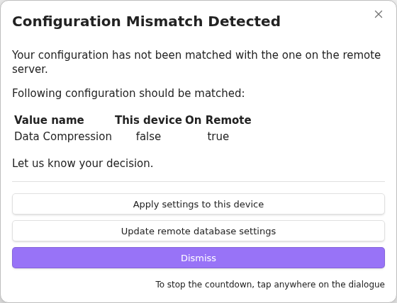

# ヒントとトラブルシューティング
- [ヒントとトラブルシューティング](#ヒントとトラブルシューティング)
  - [ヒント](#ヒント)
    - [CORS 回避](#cors-回避)
    - [リバースプロキシでの CORS 設定](#リバースプロキシでの-cors-設定)
      - [Nginx](#nginx)
      - [Nginx とサブディレクトリ](#nginx-とサブディレクトリ)
      - [Caddy](#caddy)
      - [Caddy とサブディレクトリ](#caddy-とサブディレクトリ)
      - [Apache](#apache)
    - [すべての設定ペインを表示する](#すべての設定ペインを表示する)
    - [`Tweaks Mismatched of Changed` の解決方法](#tweaks-mismatched-of-changed-の解決方法)
  - [注目すべき不具合と修正](#注目すべき不具合と修正)
    - [iOS でバイナリファイルが大きくなる](#ios-でバイナリファイルが大きくなる)
    - [一部の設定名が変更された](#一部の設定名が変更された)
  - [質問と回答](#質問と回答)
    - [複数デバイス間で設定を共有するには？](#複数デバイス間で設定を共有するには)
    - [Setup URI のパスフレーズには何を入力すればよいですか？](#setup-uri-のパスフレーズには何を入力すればよいですか)
    - [Self-hosted LiveSync 自体の設定同期がデフォルトで無効なのはなぜですか？](#self-hosted-livesync-自体の設定同期がデフォルトで無効なのはなぜですか)
    - [プラグインが `something went wrong` と表示します](#プラグインが-something-went-wrong-と表示します)
    - [大量のファイルが削除され、それが同期されてしまいました](#大量のファイルが削除されそれが同期されてしまいました)
    - [`Use an old adapter for compatibility` がなぜか有効になっています](#use-an-old-adapter-for-compatibility-がなぜか有効になっています)
    - [ZIP などの拡張子付きファイルが同期されません](#zip-などの拡張子付きファイルが同期されません)
    - [Issue 報告用の `Report` はどう作りますか？](#issue-報告用の-report-はどう作りますか)
    - [ログはどこで確認できますか？](#ログはどこで確認できますか)
    - [ログが揮発的で短期間しか残らないのはなぜですか？](#ログが揮発的で短期間しか残らないのはなぜですか)
    - [一部のネットワークログがファイルに書き込まれません](#一部のネットワークログがファイルに書き込まれません)
    - [ファイルを削除・縮小したらデータベース容量も減るはずでは？](#ファイルを削除縮小したらデータベース容量も減るはずでは)
    - [DevTools の起動方法](#devtools-の起動方法)
      - [デスクトップ](#デスクトップ)
      - [Android](#android)
      - [iOS / iPadOS](#ios--ipados)
    - [DevTools の使い方](#devtools-の使い方)
      - [ネットワークログの確認](#ネットワークログの確認)
  - [トラブルシューティング](#トラブルシューティング)
    - [Cloudflare Tunnels 使用時に Obsidian API fallback と `524` エラーが頻発する](#cloudflare-tunnels-使用時に-obsidian-api-fallback-と-524-エラーが頻発する)
    - [モバイル端末でローカルネットワーク上の同期ができない](#モバイル端末でローカルネットワーク上の同期ができない)
    - [Vault で何か悪いことが起きている気がする](#vault-で何か悪いことが起きている気がする)
    - [フラグファイル](#フラグファイル)
    - [古いヒント](#古いヒント)

<!-- - -->

## ヒント

### CORS 回避

何らかの理由で CORS を正しく設定できない場合、たとえば管理できないネットワーク機器が間にある場合は、CORS を回避する方法を選べます。
Obsidian API（Non-Native API とも呼ばれます）を使って CORS を回避するには、``Use Request API to avoid `inevitable` CORS problem`` を有効にしてください。

<!-- Add **Long explanation of CORS** here for integrity -->

### リバースプロキシでの CORS 設定

- 重要: CouchDB は CORS を自身で処理します。リバースプロキシ側で CORS を処理しないでください。
    - リバースプロキシで `Option` リクエストを処理しないでください。
    - `host` と `X-Forwarded-For` ヘッダーが CouchDB へ転送されるようにしてください。
    - サブディレクトリを使う場合は、正しく処理されていることを確認してください。詳細は [CouchDB documentation](https://docs.couchdb.org/en/stable/best-practices/reverse-proxies.html) にあります。

最小構成は次の通りです。

#### Nginx

```nginx
location / {
    proxy_pass http://localhost:5984;
    proxy_redirect off;
    proxy_buffering off;
    proxy_set_header Host $host;
    proxy_set_header X-Forwarded-For $proxy_add_x_forwarded_for;
}
```

#### Nginx とサブディレクトリ

```nginx
location /couchdb {
    rewrite ^ $request_uri;
    rewrite ^/couchdb/(.*) /$1 break;
    proxy_pass http://localhost:5984$uri;
    proxy_redirect off;
    proxy_buffering off;
    proxy_set_header Host $host;
    proxy_set_header X-Forwarded-For $proxy_add_x_forwarded_for;
}

location /_session {
    proxy_pass http://localhost:5984/_session;
    proxy_redirect off;
    proxy_buffering off;
    proxy_set_header Host $host;
    proxy_set_header X-Forwarded-For $proxy_add_x_forwarded_for;
}
```

#### Caddy

```caddyfile
domain.com {
   reverse_proxy localhost:5984
}
```

#### Caddy とサブディレクトリ

```caddyfile
domain.com {
    reverse_proxy /couchdb/* localhost:5984
    reverse_proxy /_session/* localhost:5984/_session
}
```

#### Apache

申し訳ありませんが、Apache は CouchDB 用には推奨していません。ここでは設定例を省略します。
[公式ドキュメント](https://docs.couchdb.org/en/stable/best-practices/reverse-proxies.html#reverse-proxying-with-apache-http-server) を参照してください。

### すべての設定ペインを表示する

通常、すべてのペインは表示されません。すべてのペインを表示するには、`🧙‍♂️ Wizard` -> `Enable extra and advanced features` の各トグルを有効にしてください。

参考として、すべてのペインは次の通りです。


### `Tweaks Mismatched of Changed` の解決方法

（v0.23.17 以降）

デバイス間で統一されるべき構成や tweak を変更した場合、次回同期時に他のデバイスの値を反映するかどうかを尋ねられます。
これは変更を行ったデバイス自身でも発生します。意図しない構成変更が望まない形で伝播することを防ぐためです。\
Self-hosted LiveSync を同期またはバックアップから復元した場合、この挙動に助けられることがあります。少なくとも私はそうでした。

次のダイアログが表示されます。 

- このデバイスの設定を伝播したい場合は `Update with mine` を選んでください。
- 他のデバイスでは `Use configured` を選ぶと、構成済みの設定を受け入れて使用します。
- `Dismiss` は判断を先送りできます。ただし、判断するまで同期はできません。

ほとんどの場合、`Use configured` を選んで問題ありません。（構成を変更していないと確信できる場合を除きます）

初めて表示された場合は、アップグレード後に最初にリモートと同期したデバイスの設定が反映されています。通常は受け入れてよいはずです。

<!-- Add here -->

## 注目すべき不具合と修正

### iOS でバイナリファイルが大きくなる

- 報告バージョン: v0.20.x
- 修正バージョン: v0.21.2（修正済み、未レビュー）
- 必要な操作: 大きくなったファイルは自動では修正されません。`Verify and repair all files` を実行してください。ローカルデータベースとストレージが一致しない場合は、どちらを適用するか尋ねられます。

### 一部の設定名が変更された

- 修正バージョン: v0.22.6

| 以前の名前                  | 新しい名前                                |
| --------------------------- | ----------------------------------------- |
| Open setup URI              | Use the copied setup URI                  |
| Copy setup URI              | Copy current settings as a new setup URI  |
| Setup Wizard                | Minimal Setup                             |
| Check database configuration | Check and Fix database configuration     |

## 質問と回答

### 複数デバイス間で設定を共有するには？

- デバイスのセットアップ:
    - `Setup URI` を使うのがもっとも簡単です。
- 使用中の設定変更:
    - `🔄️ Sync settings` ペインの `Sync settings via Markdown files` を使ってください。

### Setup URI のパスフレーズには何を入力すればよいですか？

- 好きなものを使って構いません。ただし、推奨は次の通りです。
    - Vault（グループ）情報を含める。
    - 操作日を含める。
    - セキュリティのためランダムな要素を含める。
    - 例: `MyVault-20240901-r4nd0mStr1ng`
- 理由:
    - Setup URI はエンコードされているため、実際の設定内容を示しません。複数の Vault で同じパスフレーズを使うと、誤って Vault を混同する可能性があります。

### Self-hosted LiveSync 自体の設定同期がデフォルトで無効なのはなぜですか？

基本的には、すべての `additionalSuffixOfDatabaseName` を同じにすれば、このファイルを複数デバイス間で同期できます。
（`additionalSuffixOfDatabaseName` は同期される Vault 単位ではなく、各デバイスで一意にする必要があります）
しかし、Self-hosted LiveSync 自身の設定を同期すると、予期しない挙動に遭遇する可能性があります。
たとえば「Self-hosted LiveSync の設定を除外する」設定が同期されると、その後に自動復旧する可能性は非常に低く、気付くことすら難しい場合があります。他のデバイスで設定を戻しても同様です。互換性のない変更が自動反映されると、さらに悪化してすべてが壊れる可能性があります。

### プラグインが `something went wrong` と表示します

原因が非常に分かりにくいケースが多くあります。可能性の一つは、チャンクの取得がうまくいかなかったことです。

1. Obsidian の再起動で改善することがあります（取得順序の問題）。
2. 実際にチャンクが存在しない場合は、他のデバイスの `🧰 Hatch` ペインで `Recreate missing chunks for all files` を実行し、再度同期してください。（Obsidian の再起動も効果がある場合があります）
3. 問題が続く場合は、`🧰 Hatch` ペインで `Verify and repair all files` を実行してください。ローカルデータベースとストレージが一致しない場合は、どちらを適用するか尋ねられます。

### 大量のファイルが削除され、それが同期されてしまいました

1. 重要なものをすべてバックアップしてください。
    - ローカル Vault。
    - CouchDB データベース（別データベースへレプリケーションすることで可能です）。
2. 空の Vault を用意します。
3. Vault のトップに `redflag.md` を置きます。
4. 設定を適用します。**ただし、まだ復元には進まないでください**。
     - `Setup URI`、QR コード、手動適用のいずれも使用できます。
5. `🩹 Patches` ペインの `Remediation` で `Maximum file modification time for reflected file events` を設定します。
    - ファイルが削除された時刻が分かる場合は、その少し前の時刻を設定してください。
    - 分からない場合は、二分探索が役立つことがあります。
6. `redflag.md` を削除します。
7. `🎛️ Maintenance` ペインで `Reset synchronisation on This Device` を実行します。

このモードは非常に壊れやすいです。注意してください。

### `Use an old adapter for compatibility` がなぜか有効になっています

あなたが慎重で経験豊富なユーザーだからです。v0.17.16 以前は、ローカルデータベースに古い adapter を使っていました。当時、現在のデフォルト adapter はまだ安定していませんでした。新しい adapter は性能が高く、purging のような新機能もあります。そのため、現在は新しい adapter を使うべきであり、デフォルトもそうなっています。

ただし、古い adapter から新しい adapter へ切り替えるには、変換やローカルデータベースの再構築が必要で、少し時間がかかります。かなり前の話ですが、データベース形式を急いで変更した際に、皆さんに不便をかけたことがあります。これらの理由から、古い adapter を使っていた Vault からアップグレードした場合、このトグルは自動的に有効になります。

すべてを再構築したり、リモートから再取得したりする際には、この切り替えについて尋ねられます。

そのため、経験豊富なユーザー、特にデータベースを再構築する必要がないほど安定して使っているユーザーの Vault では、このトグルが有効になっていることがあります。時間に余裕があるときに無効化してください。

### ZIP などの拡張子付きファイルが同期されません

Obsidian の検出方法に依存します。Obsidian の `File and links` 設定にある `Detect all extensions` を切り替えると改善する場合があります。

### Issue 報告用の `Report` はどう作りますか？

`Hatch` ペインの `Make report` ボタンを押すと、レポートをクリップボードへコピーできます。 

### ログはどこで確認できますか？

コマンドパレットの `Show log` からログペインを開けます。問題が発生している場合は、`General Setting` ペインで `Verbose Log` を有効にしてください。

ただし、ログは長期間保持されず、再起動時に消去されます。ログを確認したい場合は、一時的に `Write logs into the file` を有効にしてください。


> [!IMPORTANT]
>
> - ファイルへのログ書き込みはパフォーマンスに影響します。
> - Issue 報告前に、機密情報がすべて削除されていることを必ず確認してください。

### ログが揮発的で短期間しか残らないのはなぜですか？

機密情報が予期せず露出することを避けるためです。

### 一部のネットワークログがファイルに書き込まれません

特に CORS エラーは、セキュリティ上の理由からプラグインには一般的なエラーとして報告されます。そのため検出してログに残すことができません。[ネットワークログの確認](#ネットワークログの確認) によってのみ調査できます。

### ファイルを削除・縮小したらデータベース容量も減るはずでは？

いいえ。ファイルが削除されても、チャンクは削除されません。Self-hosted LiveSync はファイルを複数のチャンクに分割し、新しく作成されたものだけを転送します。この挙動により通信量を減らせます。また、チャンクは複数ファイル間で共有され、データベース全体の使用量を抑えます。

もう一つ重要な点として、競合が他のデバイスで発生した場合でも、どのデバイスでも競合を処理できます。つまり競合は、同期済み時点より過去に発生することがあります。そのため、現在参照されていないように見えるチャンクでも、未使用として収集・削除することはできません。

データベースサイズを縮小するには、`Rebuild everything` だけが確実で効果的です。ただし、同期がうまくできていれば心配はいりません。実体のファイルは手元にあります。少し時間と通信量がかかるだけです。

### DevTools の起動方法

#### デスクトップ

`ctrl`+`shift`+`i`（Mac では `Command`+`shift`+`i`）で DevTools を起動できます。

#### Android

[Remote debug Android devices](https://developer.chrome.com/docs/devtools/remote-debugging/) を参照してください。
DevTools が起動できれば、以降の操作は PC と同じです。

#### iOS / iPadOS

Mac がある場合は、Mac の Safari から inspect できます。[Inspecting iOS and iPadOS](https://developer.apple.com/documentation/safari-developer-tools/inspecting-ios) を参照してください。

### DevTools の使い方

#### ネットワークログの確認

1. Network ペインを開きます。
2. 赤く表示されたリクエストを探します。\
   
3. `Headers`、`Payload`、`Response` を取得します。**重要な情報は必ず秘匿してください**。`Response` に秘密情報が含まれる場合は省略できます。注意: Headers には認証情報が含まれることがあります。**リクエスト URL の path、Remote Address、authority、authorization は隠してください。**\
   

## トラブルシューティング

<!-- Add here -->

### Cloudflare Tunnels 使用時に Obsidian API fallback と `524` エラーが頻発する

`524` エラーは、サーバーへのリクエストが `指定時間` 内に完了しなかった場合に発生します。Cloudflare からのタイムアウトエラーです。報告された Issue では 100 秒のようです。 (#627)

したがって、このエラーはサーバーではなく Cloudflare から返されます。そのため結果には CORS フィールドが含まれません。これにより Obsidian API fallback が発生します。

ただし、Obsidian API fallback が発生しても、リクエストは `指定時間`、つまり 100 秒以内には完了していません。

この問題を解決するには、タイムアウト設定を変更する必要があります。

`💪 Power users` -> `CouchDB Connection Tweak` -> `Use timeouts instead of heartbeats` のトグルを有効にしてください。

### モバイル端末でローカルネットワーク上の同期ができない

Obsidian mobile は `http://` で始まるような安全でないエンドポイントへ接続できません。CouchDB の URI を確認してください。自己署名証明書も使用できません。

### Vault で何か悪いことが起きている気がする

Vault のトップに [フラグファイル](#フラグファイル) を置き、Obsidian を再起動してください。最も簡単な方法は、新しいノートを作成して `redflag` にリネームすることです。もちろん Obsidian を使わずに配置しても構いません。

たとえば `redflag.md` がある場合、Self-hosted LiveSync はすべてのデータベース処理とストレージ処理を停止します。

### フラグファイル

フラグファイルは、self-hosted LiveSync のストレージイベントとデータベースイベントを防ぐための単純な Markdown ファイルです。
存在すること自体に意味があります。空でも、文字が含まれていても構いません。

このファイルは Markdown 形式なので、Obsidian が起動できない場合でも Vault の外から配置できます。

`redflag.md` にはいくつかの使い方があります。

| ファイル名      | 分かりやすい名前      | 説明                                                                                 |
| --------------- | --------------------- | ------------------------------------------------------------------------------------ |
| `redflag.md`    | -                     | すべての処理を停止します。                                                           |
| `redflag2.md`   | `flag_rebuild.md`     | すべての処理を停止し、ローカルファイルからローカルとリモート両方のデータベースを再構築します。 |
| `redflag3.md`   | `flag_fetch.md`       | すべての処理を停止し、ローカルデータベースを破棄してリモートから再取得します。       |

すべてをリモートから取得する場合や再構築する場合、安全のため Obsidian は一度再起動されます。その際、Self-hosted LiveSync はこれらのファイルを使って処理を実行するか判断します。（通常の Markdown ファイルを使うのは、再構築や取得機能自体に問題が起きた場合、特にモバイル端末で外部から強制的にキャンセルできるようにするための工夫です）この仕組みはセットアップでも使われます。なお、これらのファイルは同期対象にもなりません。

ただし、まれにファイルの削除に失敗することがあります。通常は Obsidian を再起動すると正常に動作するはずです。（観測できている範囲では）

### 古いヒント

- まれに、データベース内のファイルが壊れることがあります。ファイルが壊れているように見える場合、プラグインはローカルストレージへ書き込みません。ローカル版のファイルがデバイス上にある場合、そのローカルファイルを編集して同期することで修復できる可能性があります。どのデバイスにもファイルが存在しない場合は救出できません。その場合は設定ダイアログから該当項目を削除できます。
- 起動シーケンスを止めるには（例: データベース問題を修正するため）、Vault のルートに `redflag.md` ファイルまたはディレクトリを置きます。iOS 向けのヒント: ファイルアプリを使えば、Vault のルートに redflag ディレクトリを作成できます。
- `redflag2.md` を置くと、起動シーケンス中にローカルとリモート両方のデータベースを自動的に再構築できます。`redflag3.md` では、ローカルデータベースだけを破棄してリモートから再取得できます。
- Q: データベースが大きくなっています。どうすれば小さくできますか？ A: 各ドキュメントは、競合検出と解決のために過去 100 リビジョンを保持して保存されます。あるデバイスがしばらくオフラインで、その後オンラインに戻る状況を想像してください。そのデバイスは、自分のノートとリモートに保存されたノートを比較する必要があります。過去のリビジョンに同一だった時点があれば、安全に更新できます（git の fast-forward のようなものです）。リビジョン履歴にそれがない場合でも、両デバイスが共通して持つリビジョン以降の差分だけを確認すれば済みます。これは git の競合解決方法に似ています。根本的に解決したい場合は、大きくなった git リポジトリのようにデータベースを作り直す必要があります。
- より技術的な情報は [Technical Information](tech_info.md) にあります。
- Obsidian なしでファイルを同期したい場合は、[filesystem-livesync](https://github.com/vrtmrz/filesystem-livesync) を使用できます。
- WebClipper も Chrome Web Store で利用できます: [obsidian-livesync-webclip](https://chrome.google.com/webstore/detail/obsidian-livesync-webclip/jfpaflmpckblieefkegjncjoceapakdf)

リポジトリはこちらです:
[obsidian-livesync-webclip](https://github.com/vrtmrz/obsidian-livesync-webclip)。
（ドキュメントは作業中です）
