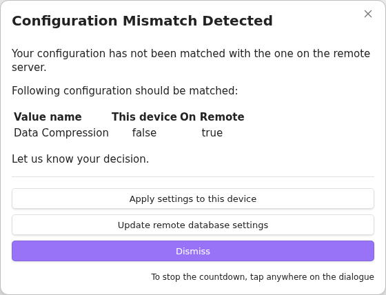

# トラブルシューティング

まず、現在見えている症状から確認してください。問題が消えるか試すためだけに、データベースをリセットしたり、同期方式を変更したり、P2Pを有効化したりしないでください。

> [!IMPORTANT]
> Obsidianが起動しない場合も復旧できます。Obsidianを閉じ、OSのファイルマネージャーでVaultルートに`redflag.md`を作成してから、[復旧とフラグファイル](recovery_ja.md)に従ってください。通常のLiveSync起動処理が始まる前に介入するための、サポートされた方法です。

設定を変更する前に次を行います。

1. 対象のVaultと、可能であればリモートデータベースまたはバケットをバックアップします。
2. ほかのデバイスでの編集を止めます。
3. 参加するすべてのデバイスが、意図したプラグインバージョンを使用していることを確認します。
4. 使用中のメインリモートがCouchDB、オブジェクトストレージ、P2Pのどれか確認します。
5. `ログを表示`を開き、最後の要約だけでなく、最初のエラーを記録します。

報告するときは、`問題報告用のデバッグ情報を含む完全なレポートを生成`を実行し、認証情報と非公開のサーバー情報を削除した上で、症状が発生した手順を添えてください。

## CouchDBへ接続できない

次の順で接続を確認します。

1. URLが完全で、目的のサーバーを指しているか確認します。
2. モバイルでは、OSが信頼する証明書を使ったHTTPSが必要です。HTTPと自己署名証明書はサポートされません。
3. ユーザー名、パスワード、データベース名、およびカスタムヘッダーを確認します。
4. プラグイン外からサーバーが応答することと、追加デバイスで接続する場合はデータベースが存在することを確認します。
5. セットアップダイアログの接続テストを使用します。
6. 基本接続に成功する場合は、**サーバー要件を確認**を実行します。最初の確認は読み取り専用です。提示されたサーバー変更は、それぞれ個別の確認が必要です。

最初にCouchDBのCORSを設定してください。リバースプロキシの例は、ほかのサーバー設定とともに[独自のCouchDBサーバーを設定](setup_own_server_ja.md)にあります。

`内部APIを使用`は、信頼できるサーバー向けの互換性回避策です。設定された認証情報をObsidianの内部リクエストAPIから送信します。接続先を確認してから有効化し、内部APIで接続できたことをサーバーやプロキシの設定が正しい証拠とは考えないでください。

Cloudflareの`524`は、オリジンサーバーを待つ間にCloudflareがタイムアウトしたことを示します。通常のCouchDB応答に含まれるCORSヘッダーが欠けることもあります。まず、時間のかかっているサーバーまたはプロキシの要求を修正してください。CouchDBの詳細設定`ハートビートの代わりにタイムアウトを使用`は、基礎となる処理が正常な場合に限り役立つことがあります。

JWT固有の設定と鍵形式のエラーは、[CouchDBのJWT認証](tips/jwt-on-couchdb.md)を参照してください。

## CouchDBは動作していたが同期が止まった

最初の対処としてP2Pへ切り替えたり、データベースをリセットしたりしないでください。次を確認します。

1. 使用中のリモートプロファイルと接続状態
2. すべてのデバイスのプラグインバージョン
3. CouchDBの応答とサーバーログ
4. LiveSyncの処理中インジケーター
5. **サーバー要件を確認**
6. LiveSyncログと完全なレポート

リモートは正常でも、1台のローカルデータベースだけが正常でない場合は、未同期のローカルファイルをバックアップしてから[このデバイスの同期状態をリセット](recovery_ja.md#このデバイスの同期状態をリセット)してください。

## 再起動後、変更していないファイルが競合として現れる

ログに `Preserved unsynchronised local changes as a conflict` と表示された場合は、内容を確認するまで両方の版を保持してください。このメッセージは、Vault 内のファイルが未変更であることを LiveSync が確認できなかったという意味であり、利用者が編集したと断定するものではありません。版を選ぶ前に、Hatch の**競合とファイル／データベースの差異を調査**で現在のブランチを確認してください。

起動時に、ファイルが現在のローカルデータベースのリビジョンと完全に一致していれば、欠けている端末内のリビジョン記録を復元できます。より新しいリビジョンがすでに到着している場合は、一致しないことがあります。その場合、未変更のコピーと、古い内容へ意図的に戻した編集を区別できないため、確認用に古いファイルを保持します。過去の内容と一致すると分かっただけでは、すでに作成された競合を新しいリリースが解消することはできません。再発する場合は、最初の関連ログ、両端末のプラグインバージョン、機密情報を除いた完全なレポート、および再現手順を添えて報告してください。

## ファイルが見つからない、または除外される

Obsidianの`すべてのファイル拡張子を検出`、LiveSyncのセレクター、除外ファイル、ファイルサイズ上限、更新日時上限、および隠しファイル同期の規則を確認します。フィルターで除外されたファイルと、データベースには到達したもののチャンクから復元できないファイルは別の問題です。

ログに不足チャンクまたはサイズ不一致がある場合は、次の順で確認します。

1. 対象ファイルの編集を止め、読み取れる内容を別に保存します。
2. 中断された取得を除外するため、Obsidianを一度再起動します。
3. 正しい内容を持つデバイスを同期するか、バックアップを復元します。
4. 正常なデバイスで`現在のVaultファイルのチャンクを再作成`を実行してから同期します。
5. [競合または不一致のあるファイルを復旧](recovery_ja.md#競合または不一致のあるファイルを復旧する)に従います。`Hatch`の`競合とファイル／データベースの差異を調査`を実行し、各リビジョンのレンチメニューから対象ブランチを確認します。
6. 対象の有効なブランチが不要だと確認できた場合だけ、`このブランチを破棄`を使用します。読み取れないリビジョンが唯一の有効な末端である場合に限り、別操作の`読み込めないリビジョンを破棄`を使用します。

修復カードの`🧩 不足チャンク：N`は読み取れないリビジョンを示します。データベース欄の`Δsize`は「復号後サイズ－記録サイズ」、`DBとの差`は「Vaultサイズ－復号後データベースサイズ」、`Δtime`は「Vault更新日時－データベース更新日時」です。これらは診断値であり、正しいリビジョンを決める規則ではありません。`✅ Vaultは採用リビジョンと一致・⚠️ 競合：N件`は、現在のVault内容が採用リビジョンと一致している一方、判断が必要な別ブランチが残っていることを示します。

`リビジョンの読み込みを再試行`はリビジョンツリーを変更しません。`このブランチを破棄`は、別の有効なブランチを残したまま、対象の有効なリビジョンに論理削除を作成します。現在のVaultファイルは変更しません。`読み込めないリビジョンを破棄`は、唯一の読み取れない有効な末端に対する明示的な退避手段です。どちらも履歴を消去したり、不足した内容を復元したりはしません。

`現在のVaultファイルのチャンクを再作成`は現在のVault内容を使用します。読み取れない履歴または競合リビジョンだけに存在する内容は再作成できません。

## 設定不一致ダイアログで同期が止まる

一部の設定はデバイス間で一致している必要があります。ローカルとリモートの値が異なる場合、LiveSyncは意図しない変更を暗黙に反映せず、同期を一時停止します。

現在のリリースは、既定で可能な場合に限り、新しいチャンクの作成方法に関する互換性のある設定を自動調整します。対象はチャンクのハッシュアルゴリズム、チャンクサイズ、および分割バージョンです。既存の内容はどの選択でも読み取れますが、異なる選択を使うとチャンク再利用率が下がり、ストレージまたは転送量が増えることがあります。自動調整を無効化して手動確認することもできます。暗号化、パス難読化、ファイル名の大文字小文字、またはそれらを含む組み合わせは、必ず手動判断になります。

旧形式のファイル名の大文字小文字設定が存在しない場合は、大文字小文字を区別しない扱いになります。明示的に無効にした設定と同等であり、この違いだけで再構築する必要はありません。明示的に有効にした設定ではドキュメントIDが異なる場合があるため、設定が存在しない場合や無効の場合との互換性を判断する必要があります。ダイアログに表示されるほかの設定の違いは、引き続き解消してください。

「内部ファイルのプロパティを暗号化」の不一致では、その設定を採用する前にすべてのデバイスを更新してください。隠しファイル同期とカスタマイズ同期の今後のメタデータ書き込みに適用され、既存のプロパティを自動で保護するものではありません。既存のパス・時刻・サイズ・チャンク参照も保護するには、リモートの手動再構築を強く推奨します。

表示される操作は、不一致を検出した時点によって異なります。

- リモートプロファイルの確認中は、`設定済みの値を使用`でリモートに保存済みの共有値を採用します。`閉じる`ではこのデバイスの設定を変えません。
- 同期前の不一致では、`このデバイスへ設定を適用`でリモート値を採用します。このデバイスの値を共有値にする場合だけ`リモートデータベース設定を更新`を選びます。
- ローカルまたはリモートの再構築が必要な場合は、取得または再構築が続くことが操作名に示されます。正しいコピーを利用できることを確認してから選択してください。
- 同期前に`閉じる`を選ぶと判断を延期します。不一致を解決するまで同期は停止したままです。

過去の不具合と旧設定名は、現在の対処手順ではなく[0.25リリース履歴](releases/0.25.md)と[従来のリリース履歴](releases/legacy.md)に残しています。

## セットアップと設定に関する質問

### リモートデータベースが未知の機能を使用している

未対応の機能を示す通知が出た場合、このデバイスと同じCouchDBデータベースを使用するすべてのクライアント（CLIを含む）を更新してください。通知には機能の識別子が表示されます。古いクライアントはメタデータとチャンク参照を正しく解釈できない場合があるため、新しい同期は拒否され、未対応の要求を受信すると実行中の同期も停止します。すでにキューにあるファイル変更は巻き戻しません。クリーンアップ済みリモートの復旧処理も、チャンク参照を数える前に互換性を確認します。確認を迂回するために、リモートのバージョンドキュメントから機能名を削除しないでください。更新後に再接続し、ガベージコレクションを実行する前に保留中のファイル変更を確認してください。

### 互換性確認のため同期が一時停止している

内部データベースや設定形式の変更、保存されたバージョン記録の不正、または以前から保留中の確認がある場合に発生します。追加デバイスやコピーしたVaultで端末固有の確認記録がないことだけでは、一時停止しません。旧版ですでに保存された一時停止は原因を特定できないため、明示的な再開が必要です。

「互換性レビューのため同期を一時停止」の説明を確認してください。閉じた場合は通知の確認リンクやコマンドから開き直せます。変更履歴を開くだけでは解除されません。「同期を再開」が利用できる場合は、すべての同期デバイスを更新してから実行してください。新しいデータベースや設定形式に対して古いバージョンを使用している場合は、データベースをリセットせずプラグインを更新してください。

### 別のデバイスへ設定を共有する

正常に動作するデバイスから、暗号化したSetup URIを生成します。追加デバイス固有の名前は維持しつつ、使用するリモートプロファイルと選択状態を引き継げます。URIとパスフレーズは別々に保管してください。

表示された期限まで共有するには「期限付き」、繰り返し利用する場合や従来形式にのみ対応したクライアントへ渡す場合は「互換（期限なし）」を選択します。期限付きURIを開けなくなった場合はデバイスの時計を確認し、正常なデバイスで新しいURIを生成してください。取り込み済みの設定や認証情報は期限後も有効です。

通常利用中に意図的に設定を変更する場合は、`同期設定`の`Markdownで設定を同期`を使用します。

### Setup URIのパスフレーズを選ぶ

Vault暗号化パスフレーズとは異なる、強いパスフレーズを使用してください。暗号化したURIの外に、対象Vaultと日付を識別できる情報を記録します。ただし、人が読める同じパターンの使い回しだけに頼らないでください。

### LiveSync自体の設定同期が既定で無効な理由

同期方式、データベース、または除外設定が自動反映されると、それを元に戻すための仕組みまで無効になることがあります。そのため、LiveSyncは既定で自身の設定をカスタマイズ同期の対象外にします。独立した復旧手段とデバイス固有のデータベース接尾辞がある場合だけ、この上級者向け動作を有効にしてください。

### プラグインが「問題が発生した」と報告する

`ログを表示`の最初の具体的なエラーから、該当する節を選んでください。チャンクまたはサイズ不一致が示される場合は、[ファイルが見つからない、または除外される](#ファイルが見つからないまたは除外される)に従います。最後の一般的なメッセージだけを理由に再構築しないでください。

### 大量の削除が反映された

すべてのデバイスを停止し、利用可能なコピーを保全してから[復旧とフラグファイル](recovery_ja.md)に従います。削除時刻が分かる場合は、`是正`の`反映するファイルイベントの最終更新日時`を使い、バックアップ済みの別Vaultへ復旧するときに適用するリモートイベントを制限できます。通常の同期設定ではなく、調査・復旧用の制約として扱ってください。

### 古いデータベースアダプターが選択されたまま

非常に古いVaultは、意図的なローカルデータベース移行またはリセットまで互換アダプターを維持することがあります。無関係な現在の問題を調べるためだけに切り替えないでください。履歴と移行情報は[従来のリリース履歴](releases/legacy.md)にあります。

### ZIPなどの拡張子が同期されない

Obsidianの`すべてのファイル拡張子を検出`を有効化し、[ファイルが見つからない、または除外される](#ファイルが見つからないまたは除外される)にあるLiveSyncセレクター、除外規則、およびサイズ上限を確認します。

## レポートを収集

`問題報告用のデバッグ情報を含む完全なレポートを生成`を実行すると、現在の設定概要と最近の詳細ログがコピーされます。共有前に、認証情報、リモートURL、Vault名、ファイル内容、およびその他の個人情報を削除してください。

1ファイルの問題では、**現在のファイルのデータベース情報をコピー**を実行します。別のファイルは、**Hatch** → **ファイルのデータベース情報をコピー**から選択できます。レポートには、このデバイスのローカルデータベースから見たVault相対パス、文書IDとチャンクID、ローカルリビジョン、競合、およびローカルチャンクの有無が含まれます。リモートへ問い合わせず、ファイル内容も含みません。共有前にパスとIDを非公開メタデータとして扱ってください。

リアルタイム確認には`ログを表示`を使用します。偶発的な漏えいを減らすため、ログは短時間だけメモリに保持されます。`ログをファイルへ書き込む`は問題の再現中だけ有効にし、確認後に無効化してファイルを削除してください。永続ログは性能へ影響し、個人情報を含む可能性があります。

CORSエラーなどのブラウザーセキュリティエラーは、一般的なネットワークエラーとしてしかプラグインへ届かない場合があります。通常ログに拒否応答が出ない場合は、ネットワークインスペクターを使用してください。

## ファイル削除後もデータベースが大きい

LiveSyncはファイルのメタデータ、チャンク、リビジョン履歴、競合、削除、および墓標を保存します。ファイルを削除または短縮しても、それを以前表していたすべてのオブジェクトが直ちに削除されるわけではありません。

ガベージコレクションV3は正常なCouchDB構成から参照されていないチャンクを削除できますが、Vaultとローカルデータベースが正常で、関係するすべてのデバイスが同期済みの場合だけ使用してください。現在のファイルと有効な競合ブランチは必要なチャンクを保護しますが、通常の上書き済みリビジョンは保護しません。墓標と保持メタデータにも容量が必要なため、最小のデータベースになる保証はありません。実行前に[ガベージコレクションV3仕様](specs_garbage_collection.md)を確認してください。

`このデバイスのファイルでサーバーデータを上書き`は別の再構築操作です。選択した正しいVaultから中央リモートを作り直すには、より確実ですが、ほかのデバイスだけに存在する変更を失う可能性がある破壊的な操作です。選択前に[復旧とフラグファイル](recovery_ja.md#ガベージコレクションは再構築ではない)を確認してください。

## ネットワーク障害を調査

### デスクトップ

`Ctrl`+`Shift`+`I`、macOSでは`Command`+`Option`+`I`で開発者ツールを開きます。

### Android

Chromeの[Androidデバイスをリモートデバッグ](https://developer.chrome.com/docs/devtools/remote-debugging/)に従います。

### iOSとiPadOS

MacのSafariを使い、Appleの[iOSとiPadOSの検査](https://developer.apple.com/documentation/safari-developer-tools/inspecting-ios)に従います。

### ネットワーク情報

1. ネットワークパネルを開きます。
2. 問題を再現し、赤色の要求を選択します。
   
3. ステータス、所要時間、および機密情報を除いたヘッダー、ペイロード、応答を記録します。
4. 共有前に、要求パス、リモートアドレス、authority、authorization、Cookie、認証情報、および応答内の秘密情報を削除します。

   

## P2Pで接続または変更転送ができない

[ピアツーピア同期のヒント](tips/p2p-sync-tips.md)を参照してください。シグナリングによる検出とWebRTCデータ経路を分けて確認し、どのデバイスが変更を通知し、追跡するかを確認します。P2Pは別の同期方式を修復する手順ではありません。

## ObsidianまたはLiveSyncが停止状態のまま

[復旧とフラグファイル](recovery_ja.md)に従います。`redflag.md`による緊急停止は、Obsidian外で削除するまで有効です。取得と再構築のフラグは意味が異なり、破壊的な可能性があります。警告を消す目的だけで作成しないでください。

## さらに詳しい技術情報

データベースと同期の内部構造は[技術情報](tech_info_ja.md)を参照してください。現在の動作はこのガイドに、過去の不具合に対する手順はリリース履歴に記載します。
